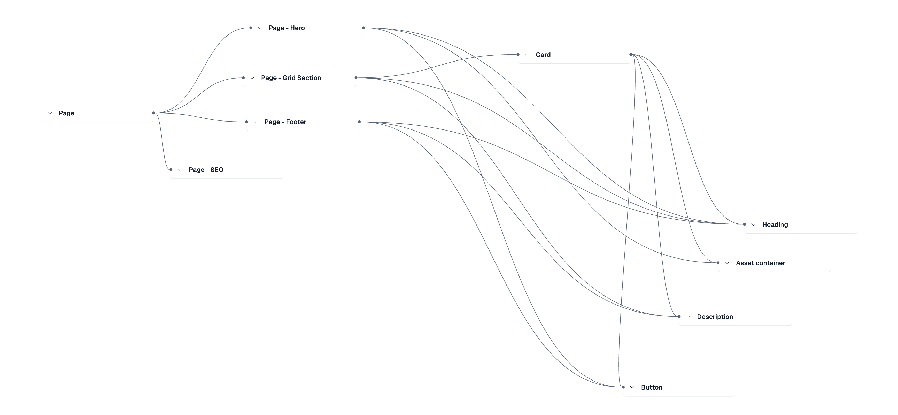
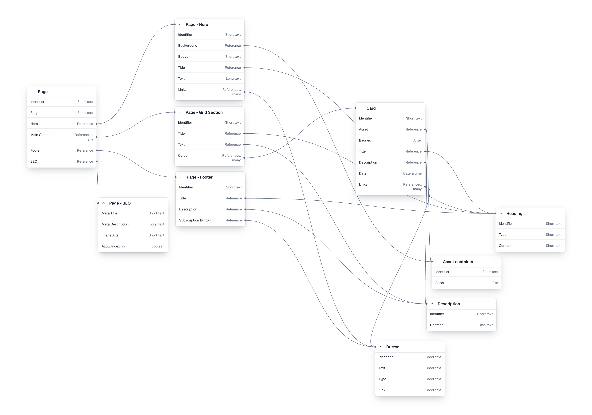

# Contentful Next.js Campaigns

This is a Next.js application integrated with Contentful CMS using GraphQL.

## Getting Started

### Prerequisites

- Node.js
- npm, yarn, or pnpm

### Environment Variables

Create a `.env.local` file in the root directory and add the following variables:

```env
CONTENTFUL_SPACE_ID=your_space_id
CONTENTFUL_PREVIEW_ACCESS_TOKEN=your_preview_access_token
```

### Installation

Install the dependencies:

```bash
npm install
```

### Running the App

Run the development server:

```bash
npm run dev
```

Open [http://localhost:3000](http://localhost:3000) with your browser to see the result.

### Scripts

- `dev`: Runs the development server.
- `build`: Builds the application for production.
- `start`: Starts the production server.
- `lint`: Runs ESLint.
- `codegen`: Generates TypeScript types from your GraphQL queries.

## Why GraphQL?

I chose to use GraphQL with Contentful because it provides a scalable solution that allows us to select the data needed for every query. This approach prevent over-fetching and ensures the application remains efficient as the content model grows.

## Contentful Schema

Below are the schema diagrams for the Contentful content model used in this project.

### Master Schema



### Extended Master Schema


